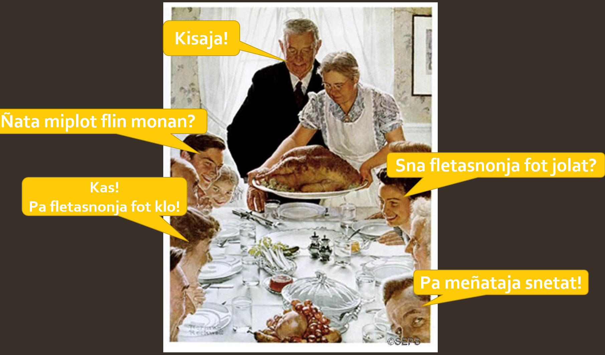

# **sañi**

#  **He'ela klośa!!!**
(Hello World!!!)


```
Sañi sonekin pesani monan
(sañi language create be.) 

Tla plenoja SOV plenan.
(it order SOV follows) 

Tla snos klot tani heklo snanan.
(it word about 1000 contains) 

Sañi sonekin flis monan.
(sañi language beautiful be)

Sañi santieko 'a pesani monon.
(sañi San Diego in created was)

Pa inklisja, españolja, en sañija manji śingi.
(I english spanish and sañi now know) 
```
> English Translation: Sañi is a created language. It follows SOV Order. It contains about 1000 words. Sañi is a beautiful language. Sañi was created in San Diego. I now know English, Spanish, and sañi. 

# **ñalot: flowot sañija kinaan. (image: people sañi talk)**
> image: people talk sañi.


```
Flano ketotja tlenpa jalon.
(family food enjoy gathered) 

Jesne masflat monan.
(man maternal grandfather be)

Sina masflal monan.
(woman maternal grandmother be)

Flano fletasnonja fot jekolon.
(family chicken big saw)

Flel fletasnonja fot flowa.
(they chicken big like)

Flano Fletasnonja fot tloson.
(family chicken big shared)

Tla śla monon.
(it good be)

Flano snima monan.
(family happy be)

Flano fleoton: "Kisaja!"
(family said (Love to you!))
```
> English Translation: The family gather to enjoy food. The man is a grandfather. The woman is a grandmother. The family saw the turkey. They like turkey. The family shared the turkey. It was good. The family is happy. The family said: "Love to you!"

# **pe śloenit (more learn):**
- [https://docs.google.com/spreadsheets/d/17JDGkP2TwkBPJFh6fUggEH7St0lyZgd386_Vo5hzYV0/edit#gid=0](https://docs.google.com/spreadsheets/d/17JDGkP2TwkBPJFh6fUggEH7St0lyZgd386_Vo5hzYV0/edit#gid=0) 
- [https://canvas.ucsd.edu/courses/40112/files/8401243?module_item_id=1579322](https://canvas.ucsd.edu/courses/40112/files/8401243?module_item_id=1579322) 
-  [https://canvas.ucsd.edu/courses/40112/files/8438997?module_item_id=1586418](https://canvas.ucsd.edu/courses/40112/files/8438997?module_item_id=1586418)
- [https://canvas.ucsd.edu/courses/40112/files/8438934?module_item_id=1586410](https://canvas.ucsd.edu/courses/40112/files/8438934?module_item_id=1586410)
- [https://canvas.ucsd.edu/courses/40112/files/8439064?module_item_id=1586443](https://canvas.ucsd.edu/courses/40112/files/8439064?module_item_id=1586443)

> **kalifoña ka snośli santieko ka jomen**
(California of university San Diego of property)

> **Ricardo Varela Tellez pesanion** (Ricardo Varela Tellez created)


- **Glossary:** (not part of website)
pesani (created): from pesani(create)